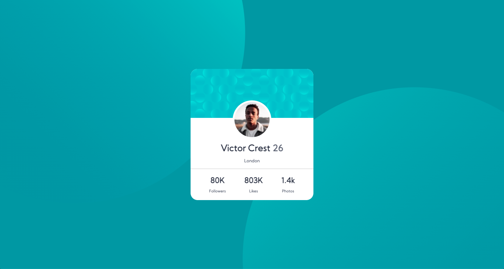

# Frontend Mentor - Profile card component solution

This is a solution to the [Profile card component challenge on Frontend Mentor](https://www.frontendmentor.io/challenges/profile-card-component-cfArpWshJ). Frontend Mentor challenges help you improve your coding skills by building realistic projects. 

## Table of contents

- [Overview](#overview)
  - [The challenge](#the-challenge)
  - [Screenshot](#screenshot)
  - [Links](#links)
- [My process](#my-process)
  - [Built with](#built-with)
  - [What I learned](#what-i-learned)
  - [Continued development](#continued-development)
  - [Useful resources](#useful-resources)
- [Author](#author)
- [Acknowledgments](#acknowledgments)

**Note: Delete this note and update the table of contents based on what sections you keep.**

## Overview

### The challenge

- Build out the project to the designs provided

### Screenshot




### Links

- Solution URL: [Add solution URL here](https://gelatodigital.com/portfolio)

## My process

### Built with

- Semantic HTML5 markup
- CSS custom properties
- Flexbox
- CSS Grid


### What I learned

The biggest challenge was to make the 2 circles on the background responsive to the screen size

this part of the css is where I spend most of the dev time
```css
    height: 100vh;
    width: 100vw;
    background-color: hsl(185, 75%, 39%);
    background-image: url("/images/bg-pattern-top.svg"),
      url("/images/bg-pattern-bottom.svg");
    background-repeat: no-repeat, no-repeat;
    background-position: -60% 190%, 150% -120%;
```

A second point of learning was to use position absolute with margin-left and margin-top, instead of height and width %. In that way, the profile pic would always stay on the correct place on the card. Given that the card itself doesn't change all that much, but the background is always reacting the screen size changes
```css
    position: absolute;
    margin-left: 120px; 
    margin-top: 90px;
```


### Continued development

Hopefully this challenge was the last time I forced myself to "complete" a piece of code instead of taking breaks and respecting my body's need for rest

### Useful resources

https://www.frontendmentor.io/solutions - Is helpfull to see what other people are using to tackle the problem. It also shows how quickly straight copy past coding proves itself useless.

## Author

- Website - [Rodrigo](https://gelatodigital.com)
- Frontend Mentor - [@yourusername](https://www.frontendmentor.io/profile/Rod-Barbosa)


## Acknowledgments

Thank you mom for calling during the hours you normally call. Next time I will take a break to talk to you.
